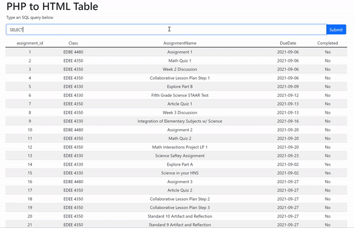

Wouldn't it be awesome if you could see the data in an SQL database from the client-side of a website? Ideally, you could type an SQL query into an HTML input and see the table dynamically form.

Disclaimer: *This would be for authorized use only because you don't want to expose your database to malicious users.*

I created a program that does exactly that. You can type SQL queries into an HTML form, hit enter or press submit, and see the result of the query dynamically populate an HTML table. See the GIF below for a demonstration.

{style="display:block; margin-left:auto; margin-right:auto;"}

Let's break down this application into its components. It has three big pieces:

-   HTML to format the document

-   PHP to retrieve the data from the database

-   JavaScript to dynamically fill the table

Shown below is the HTML code for formatting the document *(which is saved as a .php file)*. You can see that the body of the document is broken up into three sections: the header, the input box, and the dynamic table. You will also notice that I used Bootstrap 5 to format the table and structure the document into a grid with containers and rows. You can learn more about Bootstrap 5 [here](https://getbootstrap.com/docs/5.0/getting-started/introduction/).

```{html, eval = FALSE}
<!DOCTYPE html>
<html lang="en">

<head>
  <meta charset="UTF-8" />
  <meta http-equiv="X-UA-Compatible" content="IE=edge" />
  <meta name="viewport" content="width=device-width, initial-scale=1.0" />

  <!--Adding Bootstrap 5-->
  <link href="https://cdn.jsdelivr.net/npm/bootstrap@5.1.3/dist/css/bootstrap.min.css" rel="stylesheet" integrity="sha384-1BmE4kWBq78iYhFldvKuhfTAU6auU8tT94WrHftjDbrCEXSU1oBoqyl2QvZ6jIW3" crossorigin="anonymous" />
  <script src="https://cdn.jsdelivr.net/npm/bootstrap@5.1.3/dist/js/bootstrap.bundle.min.js" integrity="sha384-ka7Sk0Gln4gmtz2MlQnikT1wXgYsOg+OMhuP+IlRH9sENBO0LRn5q+8nbTov4+1p" crossorigin="anonymous"></script>

  <title>Dynamic Data Table</title>

  <!--Sourcing custom js code-->

  <script src="fillTable.js"></script>
</head>

<body>


  <div class="container">

    <!--Header-->
    <div class="row">
      <div class="col-8">
        <h1>SQL to HTML Table</h1>
        <p>Type an SQL query below</p>
      </div>
    </div>

    <!--Input Box and Submit Button-->
    <div class="row justify-content-center">
      <div class="col-12">
        <form method="post">
          <div class="input-group mb-3">
            <input type="text" name="query" class="form-control">
            <button class="btn btn-primary" type="submit" id="button-addon2">Submit</button>
          </div>
        </form>
      </div>
    </div>

    <!--Dynamic Table-->
    <div class="row px-2">
      <table id="data" class="table table-striped table-hover table-sm text-center">
        <thead id="tableHead"></thead>
        <tbody id="tableBody"></tbody>
      </table>
    </div>

  </div>

  <!--PHP File that receives the query and fetches the data-->
  <?php require 'sendQuery.php' ?>


</body>

</html>

```

Let's now look at the PHP file that handles the form data sent after submitting a query.

```{php, eval = FALSE}
<?php

if (isset($_POST['query'])) {

    // Retrieve the form data
    $sql = $_POST['query'];

    //Set connection variables
    $servername = "localhost";
    $username = "MCodrescu";
    $password = "Blackcar1997!";
    $dbname = "martha_assignments";

    // Create connection
    $conn = mysqli_connect($servername, $username, $password, $dbname);

    // Check connection
    if (!$conn) {
        die("Connection failed: " . mysqli_connect_error());
    }

    // Send the query
    $result = mysqli_query($conn, $sql);

    // Create an array of table data
    while ($row = mysqli_fetch_assoc($result)) {
        $array[] = $row;
    }

    // Close connection
    mysqli_close($conn);
} else {

    // "No data" in table if query not set.
    $array[] = array("No Data" => "Please Input a Query");
}
?>
```

Once the form is submitted, PHP retrieves the text using `$_POST['query']` and assigns it to a variable `$sql`. PHP then connects to the database, sends the query, retrieves the resulting associative array, and closes the connection. If the `$_POST['query']` value is not set then a placeholder array with "No data" is returned.

```{html}
<!--Pass the PHP array to js-->
<script>
    let tableData = <?= json_encode($array); ?>;
    fillTable(tableData);
</script>
```

Next comes the crucial piece, sending the PHP array to the client-side, with `json_encode($array)`. We assign the transferred data, now an array of JSON objects, to a variable called `tableData` and call the function `fillTable()`. The function `fillTable()` is described in the code below.

```{javascript}
// The tableData parameter should be an array of json objects
function fillTable(tableData) {
  //Selects the table head and body from the DOM
  let tableHead = document.querySelector("#tableHead");
  let tableBody = document.querySelector("#tableBody");

  // Column names, number of rows, number of columns
  let colNames = Object.keys(tableData[0]);
  let nCol = Object.keys(tableData[0]).length;
  let nRow = tableData.length;

  // Insert table head
  let firstrow = tableHead.insertRow();
  for (let index = 0; index < nCol; index++) {
    firstrow.insertCell(index).innerHTML = colNames[index];
  }

  //Insert table data
  for (let index_r = 0; index_r < nRow; index_r++) {
    let row = tableBody.insertRow();
    for (let index_c = 0; index_c < nCol; index_c++) {
      let cell = row.insertCell(index_c);
      cell.innerHTML = tableData[index_r][colNames[index_c]];
    }
  }
}

```

The `fillTable()` function will work for any sized array of JSON objects. The function finds the table in the DOM and inserts the data for the table head and body by looping through the `tableData` parameter.

Then the HTML table dynamically populates! That's all there is to it.

If you have any questions or enjoyed reading this please let me know! Thanks for reading!
